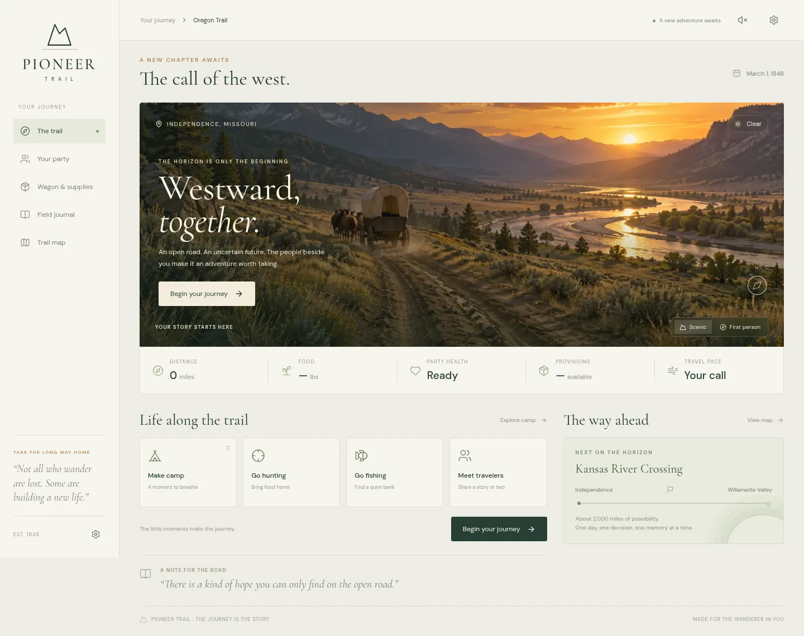

# Pioneer Trail Web

An open road. An uncertain future. The people beside you make it worth taking.

A complete browser edition of Pioneer Trail, with cinematic landscapes, illustrated first-person activities, Three.js atmosphere, procedural sound, and the original deterministic Rust game running in WebAssembly.



## Play locally

```sh
npm ci
npm run dev
```

Open **http://localhost:5173**. Node 22.12+ is required (CI uses Node 24). Rust is not needed to play or build the webapp: the browser engine is included.

Choose a trail and name your party, then select **Safe**, **Moderate**, or **Risky** supplies. **Outfit with recommended supplies** buys the whole quoted package; the next click leaves town. Plans adapt to your funds and wagon space. Expand **Shop item by item** to make your own purchases.

Year, occupation, departure month, difficulty, and seed live under **More options**. Defaults are Banker, March, Oregon, 1848. The welcome screen keeps one primary start action; the trail view shows food, party health, distance, and the next action.

If you played the initial build and hit the buying-supplies error, reload the page once to load the corrected engine initializer. Your browser save is retained.

## On the trail

- Travel day by day or automatically, stopping for decisions and party care. Set pace and rations; manage food, money, weather, illness, morale, and supplies.
- Make camp, rest, treat companions, forage, fish in river valleys, and meet named travelers. Trade, invite companions, and carry letters between supply stops.
- Face river crossings, trail forks, wheel/axle/tongue breakdowns, and the original event choices. Hunt and raft using the original seeded minigame worlds.
- Follow your route, read the field journal, and reach an ending with a scored journey.

The zoomable, draggable [geographic map](docs/MAP.md) uses offline Natural Earth coastlines/rivers, historic landmark locations, and your actual game route. It is an original map in period styling; route lines are simplified between game landmarks.

Scenic and first-person views use original artwork with subtle parallax, falling weather, embers, and water glints. Sound is opt-in. Reduced motion provides still scenes and turn-based hunting/rafting; the game remains usable without WebGL.

**Keyboard:** Enter advances; C opens camp; J journal; M map; P party; S supplies; R pace/rest; Escape closes a panel. In a hunt, arrows aim and Space fires. Raft controls steer left/right. Reduced-motion activities provide numbered actions and a one-second wait button. All actions also have pointer/touch controls.

## Saves

The journey autosaves in this browser after each game command. Settings provides export/import for backups or another device. Saves include the embedded content, pending decisions, and exact Rust RNG state; the frontend stores that JSON as an opaque string to preserve 64-bit integers.

An unfinished hunt or raft restarts from its original session seed after a reload, matching the terminal game. Closing an activity panel pauses it in the current browser session. Starting a new journey replaces the browser save; export the old one first to keep it.

## Cloudflare Pages, later

This app produces a static directory with no server, accounts, API keys, or paid runtime services.

When ready, connect this public repository to Cloudflare Pages, select Node 24, set the build command to **`npm run build`**, and set the output directory to **`dist`**. Add `trail.contractorkeith.com` through the Pages custom-domain settings. These match the [Cloudflare Pages Vite instructions](https://developers.cloudflare.com/pages/framework-guides/deploy-a-vite3-project/).

Deployment and domain configuration are deferred. `npm run preview` serves the production build locally at port 4173.

## Engine and architecture

The exact original baseline is [`ContractorKeith/pioneer-trail` at `c44bfea0651fc70a16d92d8c8449c6f3e6f9df38`](https://github.com/ContractorKeith/pioneer-trail/tree/c44bfea0651fc70a16d92d8c8449c6f3e6f9df38). The original project is unmodified.

- `engine/crates/sim` and `engine/crates/data` are byte-for-byte copies, verified against a committed hash manifest. The engine owns every game rule, cost, reward, and seeded outcome.
- `engine/crates/web` provides the browser bridge and extracts the terminal hunting/rafting algorithms, including original sprite hit masks and fixed ticks.
- `src` contains the React interface, browser persistence, and sound. React keeps the controls/state views manageable; Three.js supplies optional atmospheric depth and loads only when needed.
- `public/wasm` contains the generated browser engine. `public/scenes` contains optimized original WebP art. Fonts are self-hosted for a self-contained runtime.

To change Rust code, install Rust with the `wasm32-unknown-unknown` target and `wasm-bindgen-cli` matching `engine/Cargo.lock` (currently 0.2.126), then run `npm run build:engine`. Commit the regenerated WASM alongside its source changes.

## Verification

```sh
npm run lint
npm test
npm run test:engine
npm run build
npx playwright install chromium
npm run test:dev
npm run test:e2e
cargo test --manifest-path engine/Cargo.toml --locked
```

The artifact verifier completes all 11 legal trail/year combinations and both Oregon endings using real game commands. Unit tests purchase all three presets across all nine occupations against the shipped WASM. Browser tests exercise the production build on desktop/mobile and cold initialization plus onboarding against the development server. See [acceptance evidence](docs/ACCEPTANCE.md), [the build goal](docs/GOAL.md), and the repository's [GitHub issues](https://github.com/ContractorKeith/pioneer-trail-web/issues?q=is%3Aissue).
